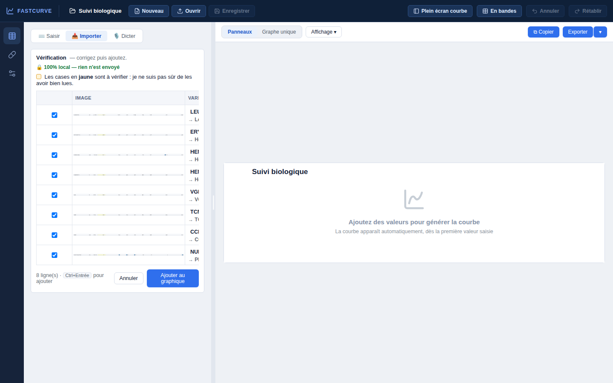
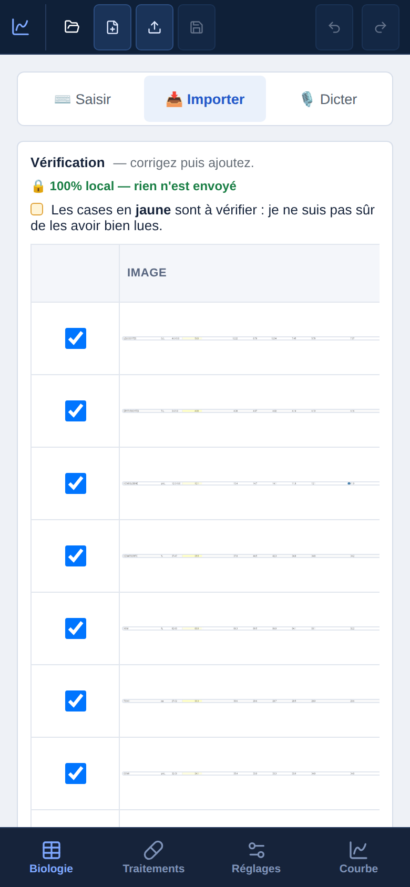
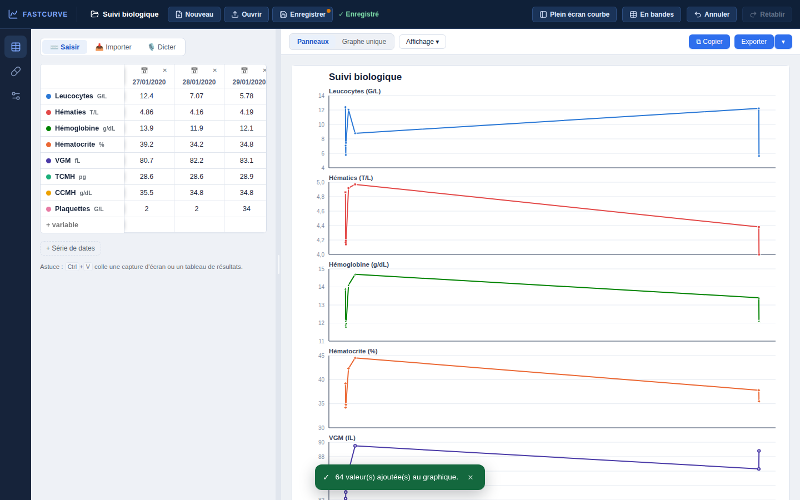
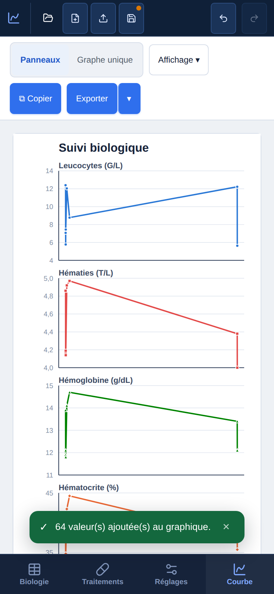
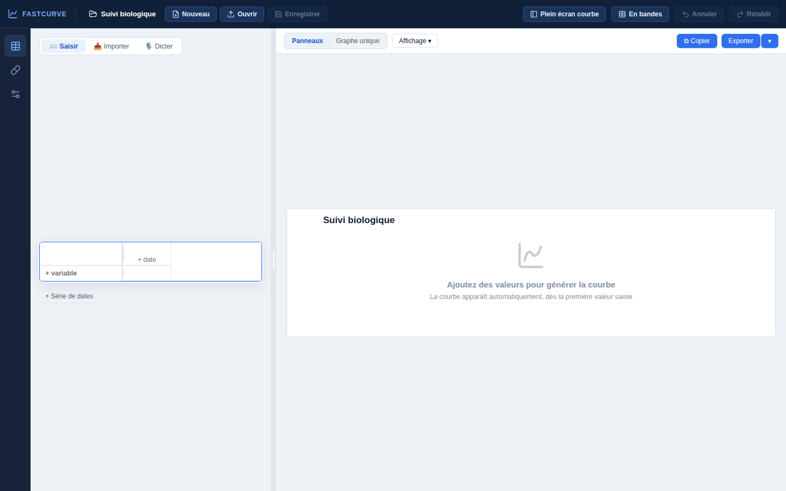

# Audit de présentation — FastCurve 1.1.0

Méthode : parcours complet (accueil → import d'une capture réelle de 11 dates →
vérification → courbe → traitements → réglages) sur bureau 1440 × 900 et
téléphone 390 × 844, captures d'écran, analyse d'accessibilité automatisée
(axe-core, WCAG 2 A/AA), relecture du code d'interface.

**Verdict global** : la base est solide et cohérente. Palette sobre et
contrastée, bonne densité d'information pour un usage clinique, navigation
claire (rail au bureau, barre du bas sur téléphone), messages en français
soigné, promesse « 100 % local » bien mise en avant. Les faiblesses se
concentrent sur **deux écrans décisifs** : la vérification d'import (là où se
joue la fiabilité) et la courbe quand les dates sont très dispersées.

## Déjà corrigé dans cette version

| Constat | Correction |
|---|---|
| 71 champs sans nom accessible dans la vérification (critique axe) | libellés sur chaque case, date et case à cocher |
| Texte bleu sur fond bleu clair sous 4,5:1 (onglets actifs, liens) | teinte d'accent assombrie pour le texte |
| « Ouvrir » inatteignable au clavier | vrai bouton |
| Graphique `role="img"` contenant des éléments interactifs | `role="figure"` |
| « ERYTHROCYTES », « TCMH », « CCMH » non reconnus → affichés en majuscules brutes à côté de « Leucocytes » | ajoutés au catalogue |
| Libellé « bêta » | retiré ; version affichée |

Résultat : **0 violation axe** sur tous les écrans au bureau et sur téléphone.

## Recommandations, par priorité

### P1 — Écran de vérification trop étroit (fiabilité)

- Au bureau, la vérification s'affiche dans le panneau de gauche (440 px) :
  les noms sont tronqués (« LEU… »), **aucune valeur n'est visible sans
  défilement horizontal**, et la vignette de la ligne d'origine (1 600 px
  réduits à 260) est illisible. Or c'est l'écran où le médecin compare lecture
  et image.
- Sur téléphone, la vignette occupe toute la largeur, les valeurs sont hors
  champ.

**Proposition** : ouvrir la vérification en **pleine largeur** (le panneau
s'élargit le temps de la vérification, la courbe revient ensuite). Remplacer
la vignette de ligne par **l'extrait de l'image au-dessus de chaque valeur**
(case d'origine agrandie, juste au-dessus du champ lu) : la comparaison
devient immédiate, case par case. Sur téléphone : une date à la fois, comme
la saisie mobile existante. *Effort : moyen.*

### P1 — Courbe écrasée quand les dates sont très dispersées

Avec des résultats de 2020 et de 2026, l'axe temporel linéaire tasse janvier
2020 en un trait vertical : six points illisibles à gauche, une longue
diagonale sans information, deux points à droite. Même effet avec deux
prélèvements le même jour.

**Proposition** : détecter les grands trous (> 3 × l'écart médian) et
**couper l'axe** (double barre oblique, segments non reliés à travers la
coupure), ou proposer d'emblée la fenêtre temporelle sur la période la plus
dense. *Effort : moyen (moteur de rendu SVG maison, tests de signature à
régénérer).*

### P2 — Iconographie mélangée

Icônes linéaires cohérentes dans les barres (rail, barre du haut) mais
**emojis** ailleurs : ⌨️ Saisir, 📥 Importer, 🎙️ Dicter, 📅, ⬇ ⬆, 📄, ⧉, 🔒
(33 occurrences). Leur rendu varie d'un système à l'autre (très différent sous
Windows, courant à l'hôpital) et casse l'aspect « outil professionnel ».
**Proposition** : remplacer par le jeu d'icônes existant (`Icon.svelte`).
*Effort : faible.*

### P2 — Barre d'outils de la courbe sur téléphone

Panneaux / Graphe unique / Affichage / Copier / Exporter occupent deux lignes,
soit ~15 % de la hauteur utile, avant même la courbe. **Proposition** : une
seule ligne — bascule d'affichage en icônes, « Exporter » en menu
regroupant Copier. *Effort : faible.*

### P2 — Barre du haut sur téléphone : icônes sans libellé

Dossier, fichier+, flèche montante, disquette : l'utilisateur doit deviner
« nom du suivi / Nouveau / Ouvrir / Enregistrer ». **Proposition** : libellés
courts sous les icônes, ou regrouper Nouveau/Ouvrir/Enregistrer dans un menu
« Fichier ». *Effort : faible.*

### P3 — États et libellés

- « Enregistrer » (pastille orange) à côté de « ✓ Enregistré » : les deux
  notions (conservé dans le navigateur / enregistré dans un fichier) se
  contredisent visuellement. Proposition : « ✓ Conservé sur ce poste ».
- Suivi vide : la grille flotte au milieu vertical du panneau gauche, au-dessus
  d'un grand vide. L'aligner en haut, avec les trois points d'entrée
  (Coller une capture / Saisir / Dicter) en évidence.

  
- Titre par défaut « Suivi biologique » affiché sur la figure : proposer de
  le renseigner au premier export.
- Les notifications vertes recouvrent le bas de la courbe pendant 3 s sur
  téléphone ; les placer en haut, ou les raccourcir.

### Points forts à conserver

- Contrastes et tailles de texte déjà travaillés (commentaires WCAG dans le
  code) ; navigation au clavier soignée (piège de focus de l'accueil,
  Ctrl+Entrée, Échap réversible).
- Cases jaunes avec motif explicite en infobulle : le bon niveau
  d'information pour un médecin pressé.
- Annulation réversible partout (« Annuler » dans les notifications).
- Mise en page mobile réellement pensée, sans débordement horizontal.
