# Audit UI/UX — FastCurve 1.5.1 → 1.6.0

Méthode : parcours complet sur bureau 1440 × 900, tablette 1024 × 768 et
téléphone 390 × 844. Le parcours couvre l'accueil, la saisie vide, l'import
d'une capture (11 valeurs sur 8 dates de 2020 à 2026), la vérification,
la courbe, l'exemple, les panneaux et le graphe unique, le menu Affichage,
l'export, les traitements, les réglages et la vue en bandes. Chaque écran a été
capturé et analysé avec axe-core (WCAG 2.1 A/AA, 18 écrans). L'audit s'appuie
aussi sur une relecture du code d'interface.

**Verdict** : l'application est mûre. La vérification d'import est devenue
excellente : pleine largeur, extrait de l'image au-dessus de chaque valeur. La
palette reste sobre, les textes sont en français soigné et la promesse
« 100 % local » est partout. Les défauts restants touchent surtout
**l'adaptation aux écrans moyens et petits**. Il y a aussi **deux notions
d'« enregistrement » qui se contredisent** dans la barre du haut, et des
réglages de présentation dispersés.

## Bilan 1.6.0 : tous les points sont traités

| Constat (1.5.1) | Correction (1.6.0) |
|---|---|
| « Enregistrer • » à côté de « ✓ Enregistré » | « ✓ Sauvegarde auto » ; pastille seulement après un 1ᵉʳ fichier enregistré |
| Barre du haut qui déborde à 1024 px | icônes seules sous 1280 px, barre de la courbe sur une ligne |
| Frise des traitements sous le pli | la courbe défile jusqu'à la frise sur l'onglet Traitements |
| Titre tronqué sur téléphone | titre et sous-titre sur plusieurs lignes |
| Grille : dates récentes hors champ | colonnes resserrées, défilement automatique vers la dernière date |
| Grille vide flottant au milieu de l'écran | grille en haut, paramètres proposés en un clic |
| Trait pointillé de 2020 à 2026 | plus aucun trait à travers une coupure, date visible pour chaque salve |
| Graphe unique : infobulle « 2 axes Y » trompeuse | infobulle exacte (2ᵉ axe si les ordres de grandeur diffèrent, unités dans la légende) |
| Réglages fourre-tout, texte « À propos » en double | Ce suivi · Confidentialité · Données · Avancé (replié) · À propos |
| Rail sans libellés | libellés sous chaque icône |
| « Importer »/« Coller », « variable »/« paramètre » | « Importer » et « paramètre » partout |
| 4 lignes « Rituximab » | une ligne « Rituximab ×4 », dépliable |
| Libellés 9,5 px sur téléphone, icônes muettes | 10 px, libellé sous chaque outil de la courbe |
| Notifications sur la courbe | en bas à gauche, au-dessus de la saisie |
| Graduations petites en diapositive | export « Image pour diapositive (texte agrandi) » |

Les 343 tests unitaires et les 10 parcours de bout en bout passent ; axe-core :
0 violation sur 18 écrans.

| Après — tablette 1024 px | Après — courbe sur téléphone |
|---|---|
| 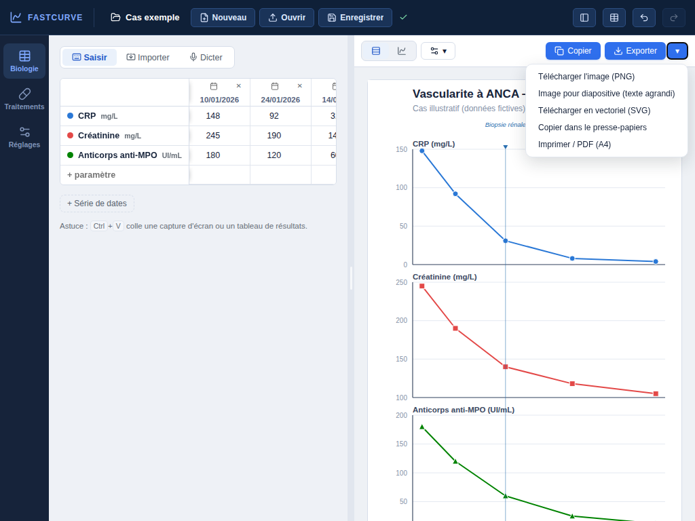 | 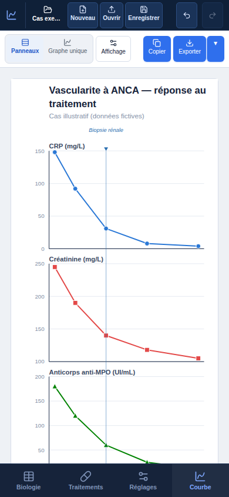 |

| Après — traitements | Après — saisie vide |
|---|---|
| 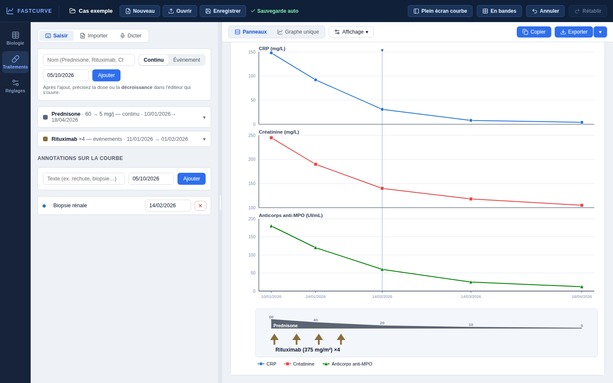 | 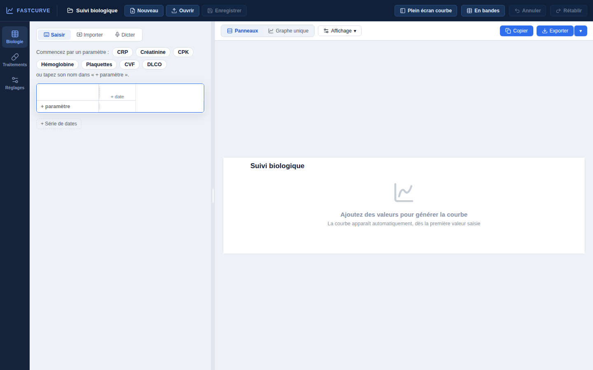 |

Le reste du document décrit l'état **avant** correction (1.5.1).

## Corrigé avant l'audit

| Constat | Correction |
|---|---|
| Arrivée en deux temps : une fenêtre de présentation chargée, puis une grille minuscule perdue dans un écran vide | Page d'accueil au style CorticoPlan : logo dégradé, accroche qui défile, barre « collez une capture », boutons Saisir / Dicter / Voir un exemple, encadré confidentialité |
| Champ de texte d'une annotation sans nom accessible (axe : *critique*) | `aria-label` ajouté |
| Lien « choisir un fichier » sous 4,5:1 sur le fond de la zone d'import | teinte d'accent « texte » |

Résultat : **0 violation axe** sur les 18 écrans.

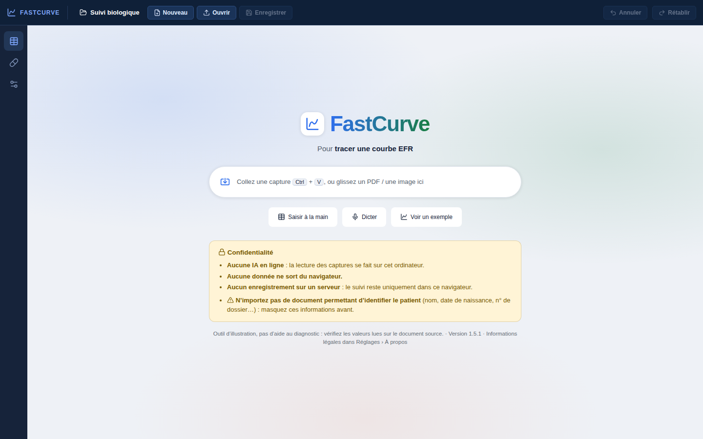

## Recommandations par priorité

### P1 — « Enregistrer • » à côté de « ✓ Enregistré »

Dès qu'une donnée est saisie, la barre du haut affiche à la fois un bouton
**Enregistrer** avec une pastille orange (« pas enregistré ») et un
**✓ Enregistré** vert. Les deux parlent de choses différentes : le fichier
.json d'un côté, la sauvegarde automatique dans le navigateur de l'autre. Pour
l'utilisateur, ils se contredisent, et c'est précisément ce qui fait craindre
une perte de données.

**Proposition** : renommer l'indicateur en « ✓ Gardé dans ce navigateur », ou
en faire une simple icône avec infobulle. Renommer le bouton
**Enregistrer le fichier**, et ne montrer la pastille que si l'utilisateur a
déjà enregistré un fichier au moins une fois. *Effort : faible.*

### P1 — Tablette / petit portable (≈ 1024 px) : barre du haut qui déborde

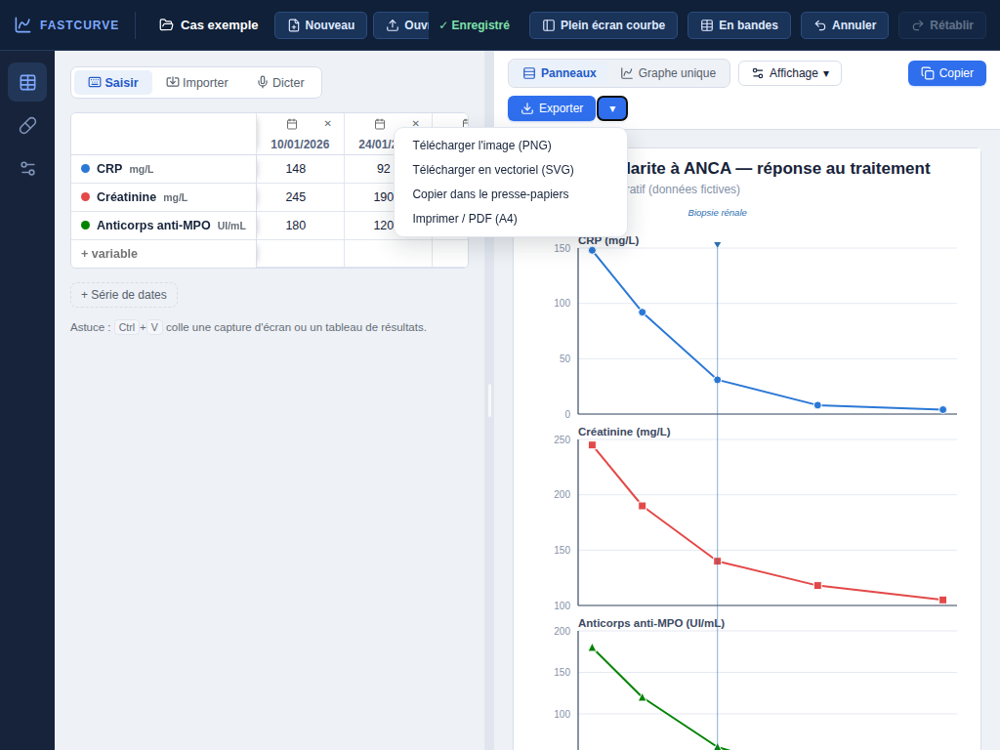

- « Ouvrir » est coupé et **« Enregistrer » disparaît sous « ✓ Enregistré »**.
- La barre de la courbe passe sur deux lignes : « Exporter » se retrouve seul
  en dessous et son menu recouvre le titre du graphique.

**Proposition** : sous 1200 px, réduire **Plein écran courbe**, **En bandes**
et **Annuler/Rétablir** à des icônes avec infobulle, comme sur téléphone. Le
menu Exporter doit s'ouvrir aligné à droite, sans couvrir le titre.
*Effort : faible.*

### P1 — Traitements : on ne voit pas ce que l'on modifie

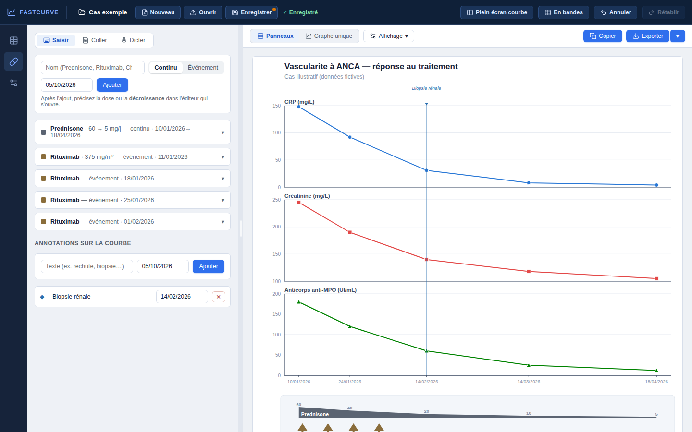

À 900 px de haut, la frise des traitements se trouve sous le pli (y ≈ 840) :
quand on modifie une décroissance de prednisone, le résultat n'est pas visible
sans faire défiler la courbe. Sur téléphone, il faut changer d'onglet.

**Proposition** : sur l'onglet Traitements, faire défiler automatiquement la
courbe jusqu'à la frise, ou la mettre en surbrillance pendant la modification.
On peut aussi réduire la hauteur des panneaux biologiques tant que cet onglet
est actif. *Effort : faible à moyen.*

### P1 — Courbe sur téléphone

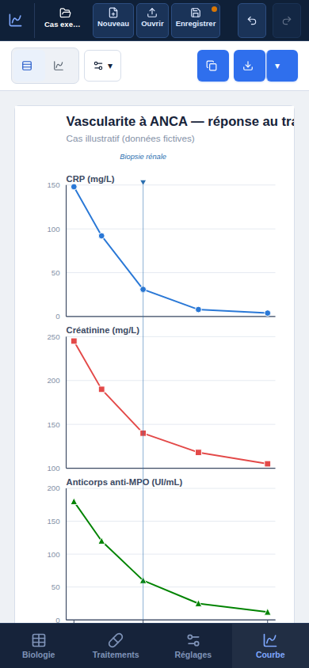

- Le **titre est tronqué** (« réponse au tra… ») au lieu de passer à la ligne.
- Les dates de l'axe X sont sous le pli (il faut faire défiler la courbe).
- La barre d'outils n'affiche que des icônes sans libellé : l'export et la
  copie se ressemblent.
- La frise des traitements est hors champ.

**Proposition** : titre sur plusieurs lignes, marge basse égale à la hauteur
de la barre de navigation, et un libellé court sous chaque icône (« Copier »,
« Exporter »). *Effort : faible.*

### P1 — Grille en colonnes : seulement 2,5 dates visibles

Dans le panneau de 440 px, la 3ᵉ date est coupée (« 14/0… »). Avec un suivi
réel de 8 à 15 dates, les **valeurs les plus récentes** (souvent les plus
utiles) sont hors champ.

**Proposition** : au-delà de 3 dates, faire défiler la grille jusqu'à la date
la plus récente, et resserrer les colonnes (date sur deux lignes : jj/mm, puis
l'année en petit). On peut aussi suggérer « En bandes » une fois, par un
toast. *Effort : faible.*

### P2 — Saisie vide : la grille flotte au milieu du vide

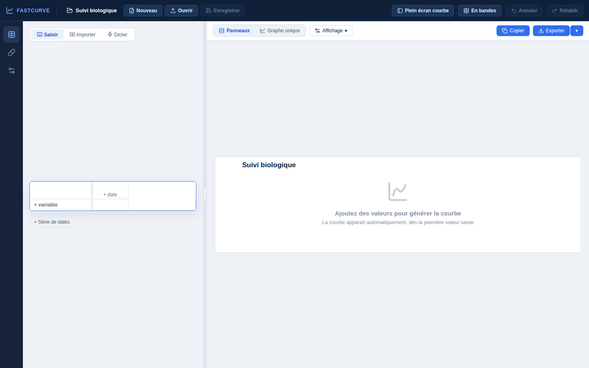

Après « Saisir à la main », la grille vide est centrée verticalement dans la
colonne gauche, avec 350 px de vide au-dessus. La carte « Ajoutez des
valeurs » occupe les deux tiers de l'écran. On ne sait pas où cliquer.

**Proposition** : grille en haut, curseur directement dans « + variable »
avec quelques suggestions en pastilles (CRP, Créatinine, CPK, CVF, DLCO…), et
première date préremplie à aujourd'hui. *Effort : faible.*

### P2 — Dates très dispersées : un trait traverse la coupure

La coupure d'axe (//) existe, mais **la CRP trace une longue ligne pointillée
de 2020 à 2026** à travers la coupure. Les 4 dates de janvier 2020 restent
tassées, et seules 3 dates sont étiquetées.

**Proposition** : ne pas relier deux points situés de part et d'autre d'une
coupure, et étiqueter chaque date mesurée quand il y en a moins de 10.
*Effort : faible.*

### P2 — Graphe unique : unités mélangées sur un seul axe

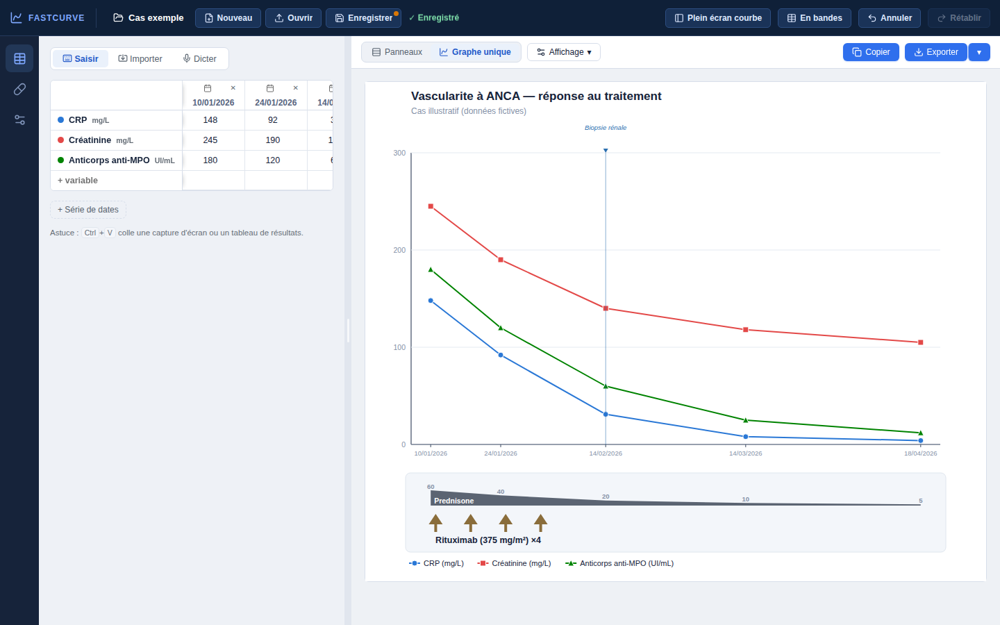

L'infobulle annonce « Un seul graphe, 2 axes Y », mais un seul axe est
affiché, **sans unité**, alors qu'il porte des mg/L et des UI/mL. La lecture
est trompeuse pour un graphique destiné à être publié.

**Proposition** : un second axe Y dès que deux unités coexistent (au-delà de
deux unités, suggérer « Panneaux »), avec l'unité affichée sur chaque axe.
*Effort : moyen.*

### P2 — « Réglages » est un fourre-tout

Cet onglet mélange le titre et le sous-titre du graphique (présentation),
les modèles de suivi, l'apprentissage (un long paragraphe), la sauvegarde et
la confidentialité. « Nom du suivi » fait doublon avec le nom affiché dans la
barre du haut.

**Proposition** : rendre le titre et le sous-titre **modifiables directement
sur la courbe** (clic sur le titre), ou les placer dans le menu Affichage.
Retirer « Nom du suivi », déjà modifiable en haut. Replier « Apprentissage »
par défaut. *Effort : moyen.*

### P2 — Rail latéral sans libellés

Au bureau, les icônes du rail (tableau, gélule, curseurs) n'ont qu'une
infobulle. Sur téléphone, la barre du bas a des libellés, au bureau non. Un
nouvel utilisateur doit survoler chaque icône pour trouver « Traitements ».

**Proposition** : un libellé de 10–11 px sous chaque icône (« Biologie »,
« Traitements », « Réglages »), en élargissant le rail à 68 px.
*Effort : faible.*

### P3 — Cohérence et finitions

- **Vocabulaire** : « Importer » (biologie) / « Coller » (traitements) pour le
  même geste ; « Graphe unique » / « graphique » ; « + variable » dans la
  grille / « paramètre » ailleurs. Choisir un terme pour chaque notion.
- **Liste des traitements** : 4 lignes « Rituximab — événement » alors que la
  courbe les regroupe déjà (« Rituximab ×4 »). Les regrouper aussi dans la
  liste.
- **Barre du haut sur téléphone** : libellés en 10 px et nom du suivi tronqué
  (« Cas exe… »). Passer à 11 px et proposer le nom complet au toucher.
- **Toasts** : en bas au centre, ils recouvrent la courbe pendant 3 s juste
  après un ajout, au moment où l'on veut la regarder. Les placer en bas à
  gauche, au-dessus du panneau de saisie.
- **Graduations de la courbe** : environ 10 px en gris clair. C'est lisible à
  l'écran, mais petit sur une diapositive. Proposer « Texte agrandi » dans
  Affichage pour l'export.

## Points forts à conserver

- **Vérification d'import** : pleine largeur, extrait de l'image au-dessus de
  chaque valeur, date d'origine et date interprétée côte à côte,
  « Ctrl+Entrée pour ajouter ».
- Collage global (Ctrl+V n'importe où), annuler/rétablir partout, toasts avec
  « Annuler » après chaque action destructive.
- Menu Affichage clair (bandes de normale, période, temps réel).
- Navigation mobile du bas, cibles tactiles ≥ 44 px, aucun débordement
  horizontal.
- Nouvel accueil : les trois façons de commencer sont visibles d'emblée, et la
  confidentialité est expliquée sans fenêtre à fermer.

  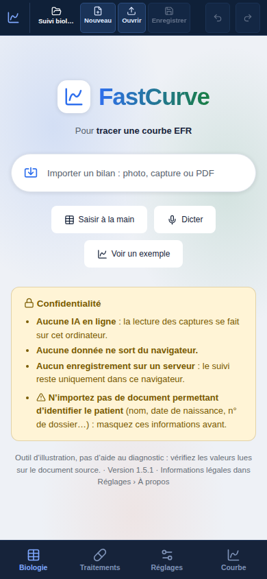
